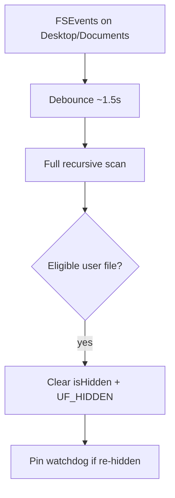

# Architecture

High-level design of **CloudUnhideWatcher** (consumer view — no source paths).

## Components

| Component | Responsibility |
|-----------|----------------|
| App lifecycle | Wires monitor, restorer, menu bar, permission probes, debounced rescans |
| Filesystem watcher | `FSEventStream` recursive watch on Desktop & Documents with restart/backoff |
| Restore logic | Eligibility checks, dual-clear hidden flags, pin watchdog for contested paths |
| Permission probe | Detects denied CloudDocs access; surfaces FDA guidance |
| File logger | Optional append-only log at `~/Library/Logs/icloud-unhide-watcher.log` |
| Menu bar UI | `NSStatusItem` + menu (no Dock icon) |
| Login item | `SMAppService` launch-at-login (macOS 13+) |
| iCloud Tools | Runs bundled shell scripts from app Resources |

Core logic lives in a testable library target; the menu bar app is a thin AppKit shell.

## Event flow

FSEvents fire on many change types, not only hidden-flag changes. The app rescans the watched trees rather than interpreting individual event flags — simple and robust for iCloud sync bursts.

## Watch paths

Default watch roots resolve to the user's iCloud Desktop and Documents folders (including when the File Provider exposes detached symlinks). Watch roots themselves are cleared if hidden so a hidden root does not hide the entire tree in Finder.

## Eligibility policy

Restored paths must be:

- Under configured watch roots
- Regular files or directories (not placeholders)
- Not dot-prefixed names
- Not excluded system names (`.DS_Store`, `.Trash`, `.icloud`, etc.)

## Failure handling

- FSEvent stream start failures → exponential backoff restart (cap 30s), status in menu bar
- Permission denial → FDA prompt and settings shortcuts
- iCloud re-hide → pin watchdog (1s interval, max 120s, release after clean checks)

## Distribution

- Developer ID signed + notarized `.app` in release DMG
- Unsandboxed (required for Apple's iCloud container)
- Bundle ID: `com.ruter.cloudunhidewatcher`

## Related

- [Project Overview](project-overview.md)
- [Operator Guide](operator-guide.md)
