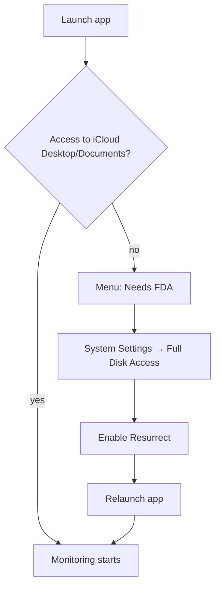

# Getting Started

## Install

1. Download `Resurrect-<version>-macos.dmg` from [GitHub Releases](https://github.com/roto31/Resurrect/releases).
2. Open the DMG and drag **Resurrect** to **Applications**.
3. Launch from Applications. Notarized builds open normally on first launch.

Install to `/Applications/Resurrect.app` — not from the DMG directly — so Full Disk Access lists the app by its proper name.

## Full Disk Access



Resurrect needs access to iCloud Drive Desktop & Documents under your user library. On many Macs this requires **Full Disk Access**.

1. Click the menu bar phoenix icon → **Enable Resurrect in Full Disk Access…**
2. In **System Settings → Privacy & Security → Full Disk Access**, enable **Resurrect**.
3. If it is not listed, click **+** and select `/Applications/Resurrect.app`.
4. Quit and relaunch the app.

If FDA still fails after a signed install:

```bash
tccutil reset SystemPolicyAllFiles com.resurrect
```

Then re-add `/Applications/Resurrect.app` in Full Disk Access and relaunch.

> **Upgrading from a previous version:** Bundle ID is now `com.resurrect`. macOS treats this as a different app — remove the old Full Disk Access entry, run `tccutil reset SystemPolicyAllFiles com.resurrect` if needed, re-grant FDA for **Resurrect**, and re-enable Launch at Login.

Also check **System Settings → Privacy & Security → Files and Folders** for any dismissed prompts.

## FDA setup assistant

On first launch (or when FDA is still required), the app may show a **Full Disk Access Setup** wizard:

1. Why FDA is needed
2. Open System Settings / Reveal in Finder
3. **I've enabled it — Check Again** (re-probes permissions)

The wizard dismisses automatically when access is confirmed. You can also open it anytime from **Enable Resurrect in Full Disk Access…** in the menu.

## In-app Help

Press **⌘?** or open **Help → Search Help…** from the menu bar. Type plain-language queries (e.g. “full disk access”, “conflict folders”, “repair”) to search documentation embedded in the app. **Browse All Topics…** lists every help article shipped with the build.

## First launch

After permissions are granted:

- Menu bar shows status (idle, restored N files, paused, or permission warning) — see [Menu Bar Navigation](navigation.md)
- The app watches Desktop and Documents automatically
- Use **Scan Now** for an immediate full scan
- Open **Settings…** (⌘,) — see [Settings Reference](settings.md) for every control

### Optional: local hidden files (v1.3.0+)

For files hidden **outside** iCloud Desktop/Documents (e.g. a project folder):

1. **Settings → Assist with local hidden files** (enable)
2. **Add Folder…** — choose folders under your home directory
3. Use **Local Tools** → **Diagnose** or **Full Local Report**
4. Optionally enable **Continuously monitor selected local folders** for background FSEvents

See [Local hidden files](local-hidden-files.md) and [Process Flows](process-flows.md#local-hidden-file-assist-v130).

## Launch at login

In **Settings → General**, enable **Launch at Login** so the watcher starts after reboot.

## Uninstall

1. Disable **Launch at Login** in Settings (or from the menu if shown).
2. Quit the app.
3. Remove `/Applications/Resurrect.app`.

## Next steps

- [Menu Bar Navigation](navigation.md) — screenshots and every menu item
- [Operator Guide](operator-guide.md) — day-to-day use
- [Process Flows](process-flows.md) — diagrams of restore and diagnose flows
- [Local hidden files](local-hidden-files.md) — opt-in non-iCloud folders
- [Troubleshooting](troubleshooting.md) — if files keep re-hiding
- [iCloud Tools](icloud-tools.md) — diagnose and merge conflict folders
