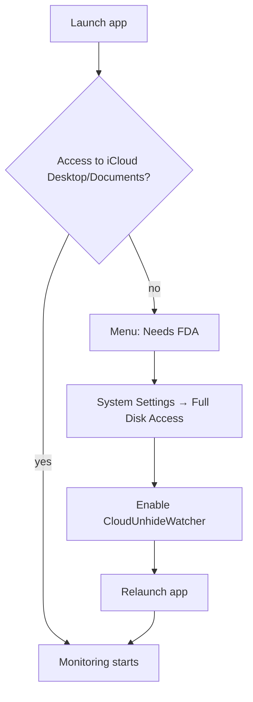

# Getting Started

## Install

1. Download `CloudUnhideWatcher-<version>-macos.dmg` from [GitHub Releases](https://github.com/roto31/CloudUnhideWatcher/releases).
2. Open the DMG and drag **CloudUnhideWatcher** to **Applications**.
3. Launch from Applications. Notarized builds open normally on first launch.

Install to `/Applications/CloudUnhideWatcher.app` — not from the DMG directly — so Full Disk Access lists the app by its proper name.

## Full Disk Access



CloudUnhideWatcher needs access to iCloud Drive Desktop & Documents under your user library. On many Macs this requires **Full Disk Access**.

1. Click the menu bar eye icon → **Enable CloudUnhideWatcher in Full Disk Access…**
2. In **System Settings → Privacy & Security → Full Disk Access**, enable **CloudUnhideWatcher**.
3. If it is not listed, click **+** and select `/Applications/CloudUnhideWatcher.app`.
4. Quit and relaunch the app.

If FDA still fails after a signed install:

```bash
tccutil reset SystemPolicyAllFiles com.ruter.cloudunhidewatcher
```

Then re-add `/Applications/CloudUnhideWatcher.app` in Full Disk Access and relaunch.

Also check **System Settings → Privacy & Security → Files and Folders** for any dismissed prompts.

## First launch

After permissions are granted:

- Menu bar shows status (idle, restored N files, paused, or permission warning) — see [Menu Bar Navigation](navigation.md)
- The app watches Desktop and Documents automatically
- Use **Scan Now** for an immediate full scan
- Open **Settings…** (⌘,) for debounce, logging, and launch-at-login

## Launch at login

In **Settings → General**, enable **Launch at Login** so the watcher starts after reboot.

## Uninstall

1. Disable **Launch at Login** in Settings (or from the menu if shown).
2. Quit the app.
3. Remove `/Applications/CloudUnhideWatcher.app`.

## Next steps

- [Menu Bar Navigation](navigation.md) — screenshots and every menu item
- [Operator Guide](operator-guide.md) — day-to-day use
- [Process Flows](process-flows.md) — diagrams of restore and diagnose flows
- [Troubleshooting](troubleshooting.md) — if files keep re-hiding
- [iCloud Tools](icloud-tools.md) — diagnose and merge conflict folders
