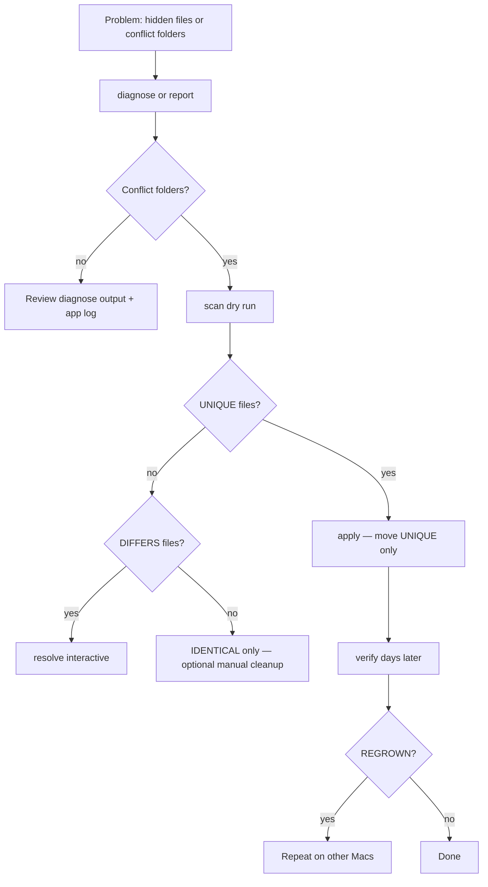
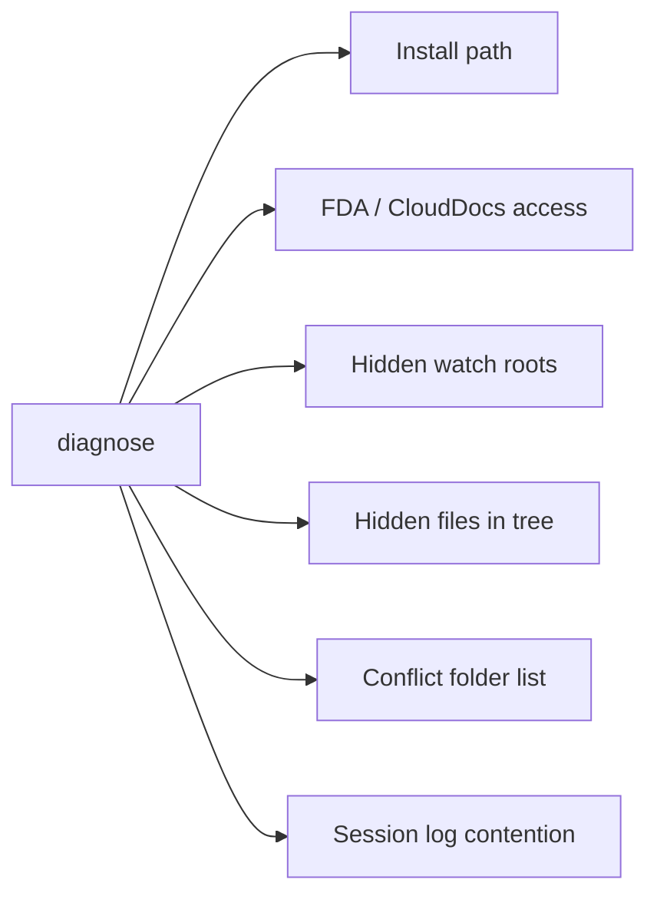

# iCloud Tools

CloudUnhideWatcher bundles the **iCloud Conflict Toolkit** inside the app:

```
/Applications/CloudUnhideWatcher.app/Contents/Resources/Scripts/
├── icloud_conflict_toolkit.sh   # unified toolkit (primary)
├── diagnose_rehide.sh           # legacy wrapper → diagnose
└── merge_icloud_conflicts.sh    # legacy wrapper → scan / apply / verify
```

Run commands from the menu (**iCloud Tools**) or from Terminal. Non-interactive reports are written to `~/Library/Logs/CloudUnhideWatcher/`.

## Workflow diagram



## Toolkit commands

| Command | Menu item | Description |
|---------|-----------|-------------|
| `diagnose` | Diagnose iCloud Health… | FDA, hidden files, conflict folders, log analysis (read-only) |
| `report` | Full Report… | `diagnose` + `scan` together |
| `scan` | Scan Conflict Folders… | Dry run — UNIQUE / IDENTICAL / DIFFERS |
| `apply` | Apply Conflict Merge… | Move UNIQUE files only; save verify baseline |
| `verify` | Verify Conflict Folders… | Compare to last apply snapshot (regrowth?) |
| `resolve` | Resolve Conflicting Files… | Interactive Terminal session for DIFFERS files |

### Safety

- Never deletes files or folders.
- `scan` and `diagnose` are fully read-only.
- `apply` moves only files that do not already exist in the live folder.
- `resolve` backs up the live copy before any overwrite.

Apply/verify snapshots are stored under `~/.icloud_conflict_toolkit_state/`.

## What diagnose checks



## Conflict folder categories

| Category | Meaning | Toolkit action |
|----------|---------|----------------|
| **UNIQUE** | In conflict folder only | Moved with `apply` |
| **IDENTICAL** | Same name, byte-for-byte match in live folder | Listed only |
| **DIFFERS** | Same name, different content | Use `resolve` (interactive) |

## Terminal equivalents

```bash
TOOLKIT="/Applications/CloudUnhideWatcher.app/Contents/Resources/Scripts/icloud_conflict_toolkit.sh"

bash "${TOOLKIT}" diagnose
bash "${TOOLKIT}" report
bash "${TOOLKIT}" scan
bash "${TOOLKIT}" apply
bash "${TOOLKIT}" verify
bash "${TOOLKIT}" resolve   # interactive — run in Terminal
```

Legacy wrappers (same behavior):

```bash
SCRIPTS="/Applications/CloudUnhideWatcher.app/Contents/Resources/Scripts"
bash "${SCRIPTS}/diagnose_rehide.sh"
bash "${SCRIPTS}/merge_icloud_conflicts.sh"           # → scan
bash "${SCRIPTS}/merge_icloud_conflicts.sh" --apply   # → apply
bash "${SCRIPTS}/merge_icloud_conflicts.sh" --verify  # → verify
```

## When to use

1. **Diagnose** or **Full Report** when files keep re-hiding.
2. **Scan** when diagnose reports conflict folders.
3. **Apply** when scan shows mostly UNIQUE files you want in live folders.
4. **Verify** days later to confirm conflict folders stopped growing.
5. **Resolve** when scan/apply lists DIFFERS files needing manual choice.

## Related

- [Process Flows](process-flows.md)
- [Troubleshooting](troubleshooting.md)
- [Operator Guide](operator-guide.md)
