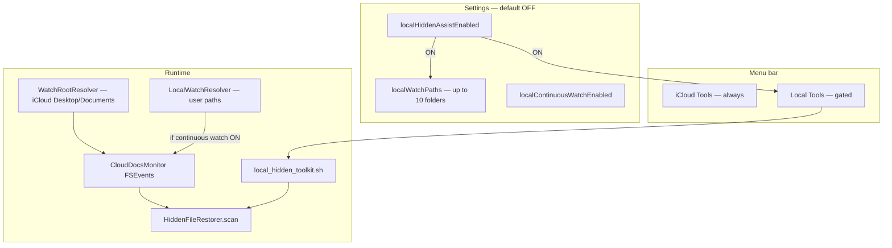
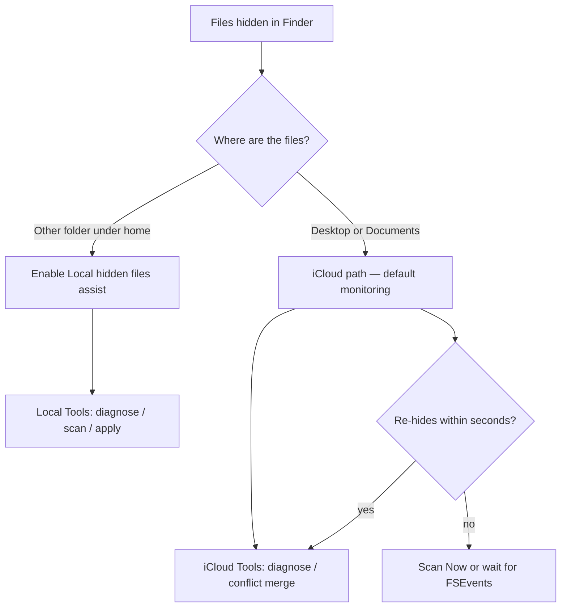
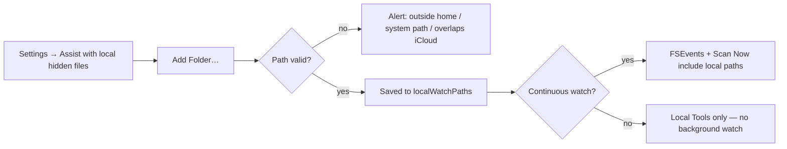
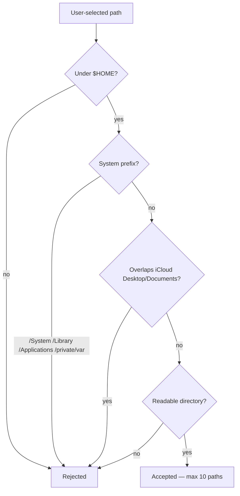
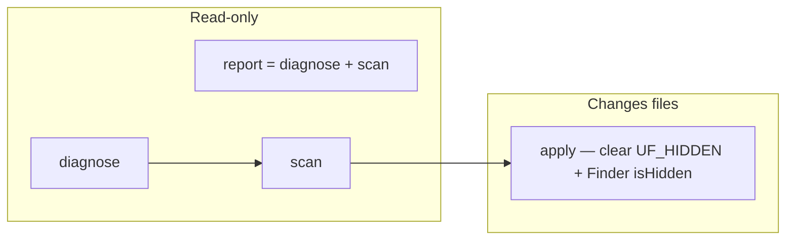
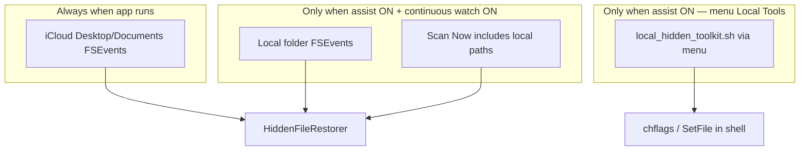

# Local hidden files (non-iCloud)

CloudUnhideWatcher **v1.3.0+** adds an **opt-in** feature for folders **outside** iCloud Desktop & Documents. Default is **off** — iCloud monitoring is unchanged.

## Architecture overview



## When to use

Enable **Assist with local hidden files** in Settings when:

- Finder or `chflags hidden` accidentally hid files in a local project folder, Downloads subtree, or other non-iCloud path
- You want diagnose/scan/apply tools for those folders without changing default iCloud-only behavior

## When **not** to use

This feature does **not**:

- Rename or un-hide dotfiles (`.git`, `.env`, etc.) — those are intentionally hidden by convention
- Repair `.hidden` manifest files (diagnose **detects** them; edit manually)
- Merge iCloud conflict folders — use [iCloud Tools](icloud-tools.md) instead
- Watch `/System`, `/Library`, `/Applications`, or your entire home folder

## iCloud vs local — decision flow



## Settings

| Control | Default | Behavior |
|---------|---------|----------|
| Assist with local hidden files | **Off** | Shows **Local Tools** menu and folder list |
| Folder list | Empty | Up to 10 folders under your home directory |
| Continuously monitor selected local folders | **Off** | Adds saved folders to FSEvents when master toggle is on |

iCloud Desktop/Documents monitoring is unchanged and remains on by default.

### Settings activation flow



### Path validation (`LocalWatchResolver`)



## Menu: Local Tools

When the master toggle is on:

| Menu item | Command | Modifies disk? |
|-----------|---------|----------------|
| Diagnose Local Hidden Files… | `diagnose` | No |
| Scan Local Folders (dry run)… | `scan` | No |
| Apply Local Restore… | `apply` | Yes — clears hidden flags only |
| Full Local Report… | `report` | No |

If no folders are saved in Settings, toolkit runs prompt you to pick folders via **Add Folder…** (one-off `NSOpenPanel`).

### Local toolkit command flow



## Continuous watch vs one-off toolkit



| Mode | FSEvents | Scan Now | Menu toolkit |
|------|----------|----------|--------------|
| Assist OFF | iCloud only | iCloud only | Hidden |
| Assist ON, continuous OFF | iCloud only | iCloud only | Available |
| Assist ON, continuous ON | iCloud + local paths | iCloud + local paths | Available |

## Terminal usage

Bundled script path:

```bash
TOOLKIT="/Applications/CloudUnhideWatcher.app/Contents/Resources/Scripts/local_hidden_toolkit.sh"
bash "${TOOLKIT}" diagnose --paths-file ~/my-paths.txt
bash "${TOOLKIT}" scan "/Users/you/Projects/MyApp"
bash "${TOOLKIT}" apply --paths-file ~/my-paths.txt
bash "${TOOLKIT}" report --paths-file ~/my-paths.txt
```

`--paths-file` is one absolute path per line (same format the app writes when launching from the menu).

## Eligibility (same as iCloud restore)

| Restored | Skipped |
|----------|---------|
| Regular files/folders under chosen paths | Names starting with `.` |
| Watch root if hidden | `.icloud` placeholders |
| | `.DS_Store`, `.Trash`, protected system names |

## Full Disk Access

Some local paths may require **Full Disk Access** for CloudUnhideWatcher — same as iCloud monitoring. Enable the app in **System Settings → Privacy & Security → Full Disk Access**.

## State and logs

| Item | Location |
|------|----------|
| Toolkit state | `~/.cloudunhide_local_state/` |
| Full script output | `~/Library/Logs/CloudUnhideWatcher/local_hidden_toolkit.sh.*.log` |
| App file log | `~/Library/Logs/icloud-unhide-watcher.log` |

## Related

- [Menu Bar Navigation — Local Tools](navigation.md#local-tools-submenu)
- [Process Flows — Local Hidden File Assist](process-flows.md#local-hidden-file-assist-v130)
- [iCloud Tools](icloud-tools.md) — conflict folders and iCloud-specific diagnose
- [Troubleshooting — local paths](troubleshooting.md#local-non-icloud-hidden-files)
- [Architecture](architecture.md)
