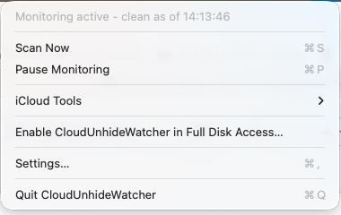
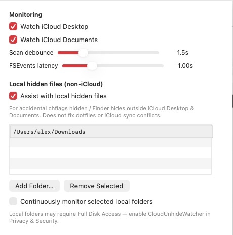
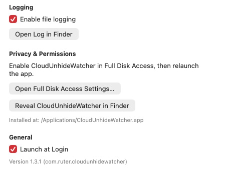
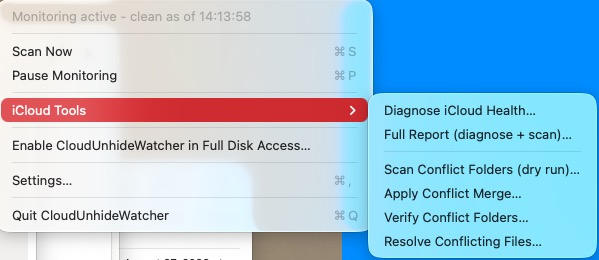

# Operator Guide

For screenshots and a full menu walkthrough, see **[Menu Bar Navigation](navigation.md)**.

For **every Settings control**, defaults, and how each option changes runtime behavior, see **[Settings Reference](settings.md)**.

## Menu bar

Click the eye icon in the menu bar:

| Item | Action |
|------|--------|
| Status line | Current state (idle, restored count, paused, FDA needed) |
| **Scan Now** | Immediate full scan of watched folders |
| **iCloud Tools** | Run bundled diagnose / conflict-merge scripts |
| **Local Tools** | Local hidden-file toolkit (when enabled in Settings) |
| **Pause Monitoring** | Stop FSEvents without quitting |
| **Enable CloudUnhideWatcher in Full Disk Access…** | Opens Privacy & Security (when access denied) |
| **Settings…** (⌘,) | Preferences window — see [Settings Reference](settings.md) |
| **Quit** | Exit the app |

## Settings (summary)

Open **Settings…** (⌘,). Full documentation: **[Settings Reference](settings.md)**.

| Section | Purpose |
|---------|---------|
| **Monitoring** | iCloud Desktop/Documents toggles, scan debounce, FSEvents latency |
| **Local hidden files** | Opt-in non-iCloud folders (v1.3.0+) — see [Local hidden files](local-hidden-files.md) |
| **Logging** | File log at `~/Library/Logs/icloud-unhide-watcher.log` |
| **Privacy & Permissions** | FDA shortcuts and install path |
| **General** | Launch at Login, version string |

## iCloud Tools

The **iCloud Tools** submenu runs maintenance scripts bundled inside the app. Reports are saved under `~/Library/Logs/CloudUnhideWatcher/`.

See [Menu Bar Navigation](navigation.md#icloud-tools-submenu) and [iCloud Tools](icloud-tools.md) for each menu item and toolkit command.

## Local Tools (optional)

When **Assist with local hidden files** is enabled in Settings, the **Local Tools** submenu runs `local_hidden_toolkit.sh` for folders outside iCloud Desktop/Documents.

See [Local hidden files](local-hidden-files.md), [Menu Bar Navigation — Local Tools](navigation.md#local-tools-submenu), and [Process Flows — Local assist](process-flows.md#local-hidden-file-assist-v130).

## What gets unhidden

The app clears hidden flags only on **eligible user files**:

- Regular files and folders under Desktop/Documents **and** (when enabled) saved local watch paths
- Not dotfiles (names starting with `.`)
- Not `.icloud` placeholders or known system files (e.g. `.DS_Store`, `.Trash`)

When iCloud repeatedly re-applies the hidden flag, the app uses a short pin watchdog (1s re-clears, up to 120s) on contested paths.

## MDM deployment

For managed Macs, pre-approve Full Disk Access via a PPPC configuration profile for bundle ID `com.cloudunhidewatcher` rather than relying on interactive prompts.

### Sample PPPC payload (FDA only)

Use your MDM’s profile editor or a `.mobileconfig` with a `com.apple.TCC.configuration-profile-policy` payload. Example keys (no secrets):

| Key | Value |
|-----|-------|
| `Service` | `SystemPolicyAllFiles` |
| `Identifier` | `com.cloudunhidewatcher` |
| `IdentifierType` | `bundleID` |
| `Allowed` | `true` |
| `CodeRequirement` | Match your signed `CloudUnhideWatcher.app` requirement string from `codesign -dr -` |

After deploying the profile, users should not need the FDA setup wizard. Re-deploy when the Team ID or signing identity changes.

**Note:** Upgrades from the v1.3.x bundle ID require a new PPPC entry for `com.cloudunhidewatcher`.

## Related

- [Settings Reference](settings.md) — complete Settings documentation
- [Menu Bar Navigation](navigation.md)
- [Local hidden files](local-hidden-files.md)
- [Getting Started](getting-started.md)
- [Troubleshooting](troubleshooting.md)
- [Architecture](architecture.md)
