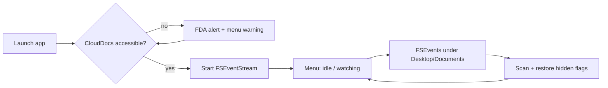
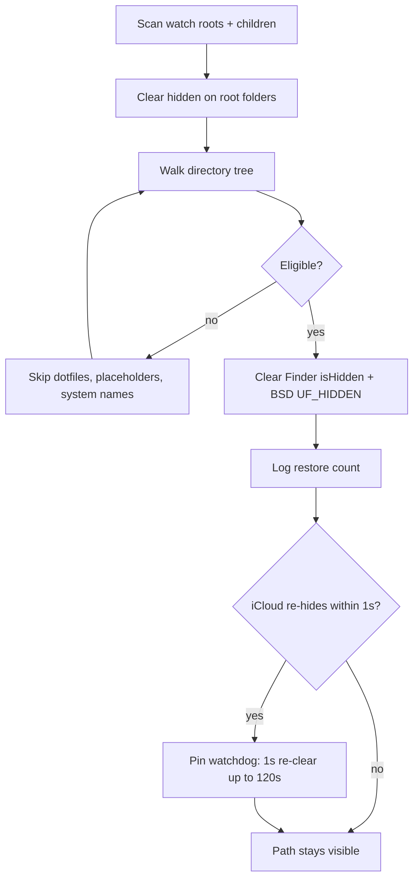
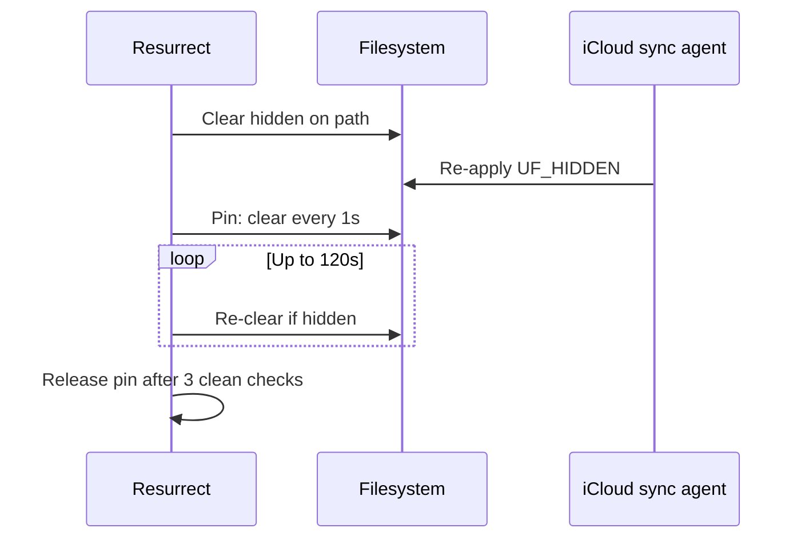
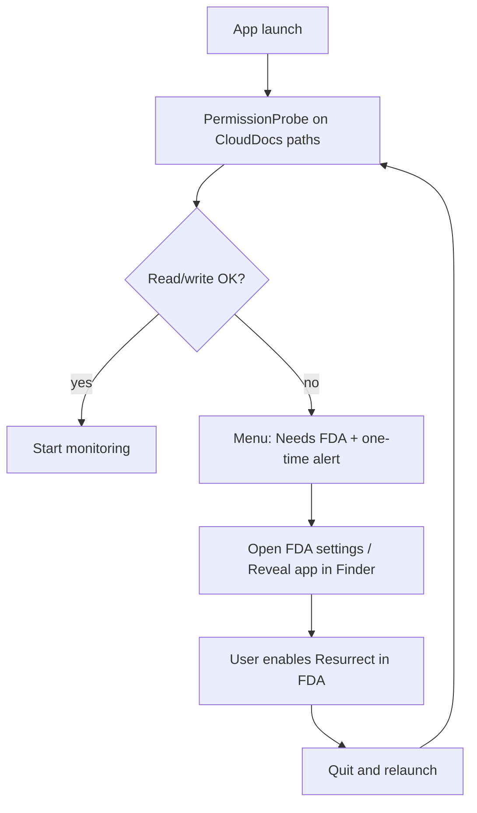
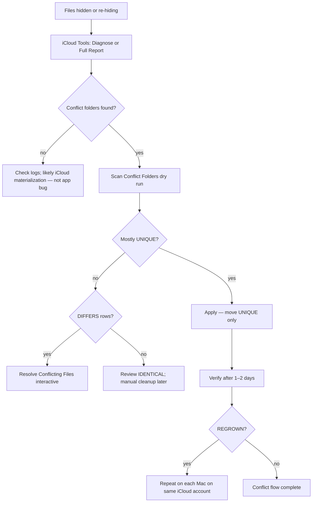
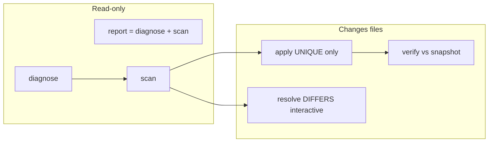
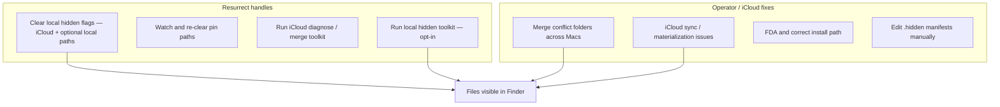
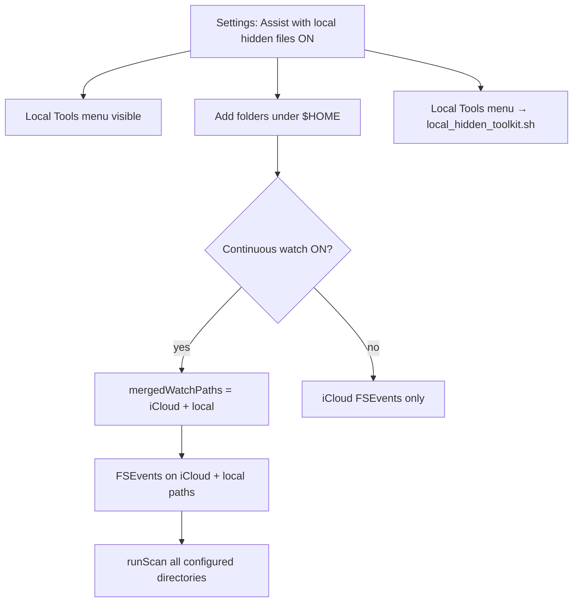
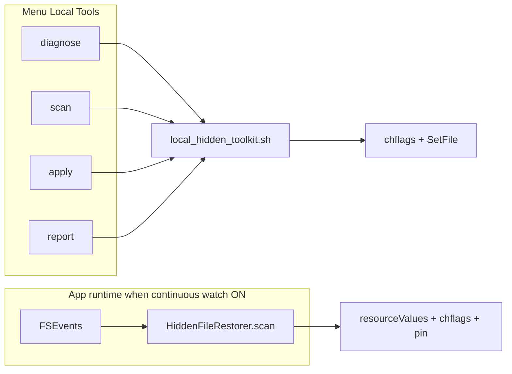
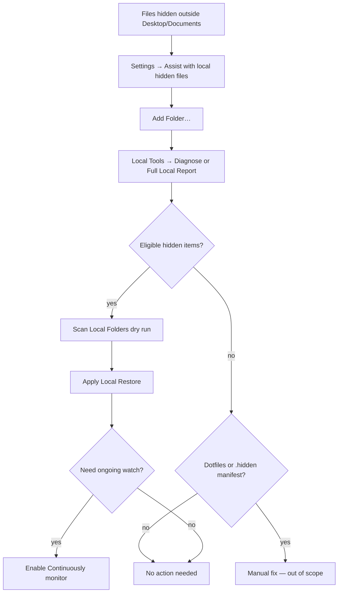

# Process Flows

Visual reference for how **Resurrect** watches folders, restores hidden files, and how **iCloud Tools** diagnoses and resolves sync issues.

## Application lifecycle

## Hidden-file restore pipeline

When a scan runs (on FSEvents or **Scan Now**), each path is evaluated and cleared if eligible.

### Eligibility (what gets restored)

| Included | Excluded |
|----------|----------|
| Regular files and folders under watch roots | Names starting with `.` |
| User content in Desktop/Documents | `.icloud` placeholders |
| Watch roots themselves if hidden | `.DS_Store`, `.Trash`, etc. |

## Pin watchdog (re-hide fight)

iCloud sometimes re-applies `UF_HIDDEN` seconds after the app clears it. The pin watchdog keeps clearing contested paths until they stay visible.

## Full Disk Access flow

Install from `/Applications/Resurrect.app` so FDA lists the correct app name (not `swift`).

## Operator troubleshooting flow

Use this when files keep disappearing from Finder or re-hide repeatedly.

## iCloud Tools command flow

| Step | Command | Modifies disk? |
|------|---------|----------------|
| Health check | `diagnose` | No |
| Full picture | `report` | No |
| Preview merge | `scan` | No |
| Move UNIQUE files | `apply` | Yes (copy/move UNIQUE only) |
| Check regrowth | `verify` | No |
| Fix name collisions | `resolve` | Yes (with backup) |

## What the app does vs what you must fix

## Local Hidden File Assist (v1.3.0+)

Optional feature for **non-iCloud** folders. Off by default. See [Local hidden files](local-hidden-files.md) for full reference.

### Activation and runtime merge

### Local toolkit vs in-app restore

| Path | Trigger | Engine |
|------|---------|--------|
| Background restore | FSEvents or **Scan Now** | Swift `HiddenFileRestorer` (with pin watchdog) |
| Menu toolkit | **Local Tools** items | Bash `local_hidden_toolkit.sh` |
| One-off folder | No saved paths → folder picker | Toolkit with `--paths-file` manifest |

### Local troubleshooting flow

## Related

- [Architecture](architecture.md)
- [Local hidden files](local-hidden-files.md)
- [iCloud Tools](icloud-tools.md)
- [Troubleshooting](troubleshooting.md)
- [Getting Started](getting-started.md)
