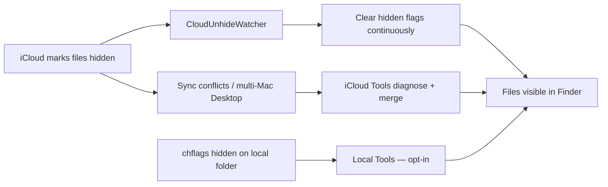

# Project Overview

## Purpose

**CloudUnhideWatcher** is a macOS menu bar utility that mitigates a specific iCloud Drive symptom: user files under Desktop and Documents marked hidden after sync conflicts or failed materialization (dataless/evicted placeholders).

The app watches those folders and clears hidden flags on eligible user content so Finder shows files again.

## What it is not

- Not a replacement for fixing iCloud sync (conflict folders, multi-Mac Desktop & Documents, stuck materialization queues)
- Not documented or endorsed by Apple for this behavior — the hidden-on-conflict pattern was observed empirically
- Not a sandboxed Mac App Store app — it must access Apple's `com~apple~CloudDocs` container unsandboxed

## Typical users

- Individual Mac users with iCloud Desktop & Documents enabled
- Operators supporting users who see "missing" files that are actually hidden
- MDM environments that can pre-approve Full Disk Access via PPPC profiles

## Core capabilities

| Capability | Description |
|------------|-------------|
| Continuous watch | Recursive FSEvents on iCloud Desktop & Documents |
| Auto-restore | Clears `isHidden` and `UF_HIDDEN` on eligible paths |
| Pin watchdog | Re-clears paths iCloud keeps re-hiding (up to 120s) |
| Menu bar control | Status, Repair, scan, pause, Help, settings, quit |
| Repair iCloud Folders | Guided diagnose + scan with next-step prompts (v1.4.0+) |
| In-app Help | Embedded docs + plain-language search (⌘?) (v1.4.0+) |
| iCloud Tools | Bundled toolkit; Advanced commands opt-in (v1.4.0+) |
| In-app DIFFERS resolve | Review conflicting files without Terminal (v1.4.0+) |
| Local hidden assist | Opt-in local folder toolkit + optional continuous watch (v1.3.0+) |
| Launch at login | `SMAppService` on macOS 13+ |

## Requirements

- macOS 13.0 (Ventura) or later
- iCloud Drive with Desktop & Documents folders
- Full Disk Access recommended
- Signed, notarized build from [Releases](https://github.com/roto31/CloudUnhideWatcher/releases) for distribution

## Related

- [Process Flows](process-flows.md)
- [Local hidden files](local-hidden-files.md)
- [Architecture](architecture.md)
- [Getting Started](getting-started.md)
- [Comparison guide](comparison.md)
- [Troubleshooting](troubleshooting.md)
