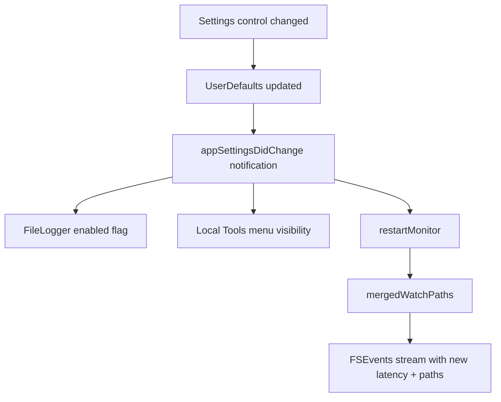

# Settings Reference

Open **Settings…** from the menu bar (⌘,) or choose it after clicking the phoenix icon. All controls write to `UserDefaults` under `com.resurrect.settings.*` and apply **live** where possible. When a setting affects FSEvents or watch roots, the app posts `appSettingsDidChange` and **restarts the filesystem monitor** automatically.

The window scrolls on smaller displays. Screenshots below use fictional paths (`/Users/alex/...`).

## Monitoring and local folders

## Logging, privacy, and general

---

## Monitoring

Controls the core iCloud Desktop & Documents watcher — the primary reason most users install Resurrect.

| Control | Default | Range / type | What it does | How it affects the app |
|---------|---------|--------------|--------------|------------------------|
| **Watch iCloud Desktop** | On | Checkbox | Includes `~/Desktop` in watch roots and scans. | **On:** FSEvents stream includes Desktop; **Scan Now** and automatic rescans clear hidden flags under Desktop. **Off:** Desktop is ignored — no FSEvents, no scans, conflict-folder checks skip Desktop. |
| **Watch iCloud Documents** | On | Checkbox | Same for `~/Documents`. | **On:** Documents is watched and scanned. **Off:** Documents is ignored entirely. |
| **Scan debounce** | 1.5 s | 0.5–5.0 s (0.1 s steps) | Minimum wait after the **last** FSEvents burst before running `HiddenFileRestorer.scan`. | **Lower:** Faster response to single file changes; more CPU and log noise during iCloud sync storms. **Higher:** Fewer rescans when iCloud touches many files at once; slightly slower unhide after a change. Does **not** delay **Scan Now** (⌘S) — that runs immediately. |
| **FSEvents latency** | 1.00 s | 0.25–3.0 s (0.05 s steps) | Passed to `FSEventStreamCreate` as the kernel coalescing latency. | **Lower:** Events arrive sooner; monitor reacts faster but may deliver more callbacks. **Higher:** macOS batches more events per callback — less callback overhead, slightly slower detection. Changing this **restarts** the FSEvents stream. |

### If both iCloud toggles are off

The monitor has no iCloud paths. Unless **Local hidden files → Continuously monitor** is on with saved folders, the app shows a startup error (`No watch folders configured` or `iCloud Desktop/Documents folders not found`) and does not watch anything.

### Interaction with conflict detection

`ConflictFolderMonitor` only lists conflict folders under roots you still watch. Turning off Desktop or Documents stops reporting conflicts for that side.

---

## Local hidden files (non-iCloud)

**Opt-in extension (v1.3.0+).** Default **off** so iCloud-only users see no change. Does not replace [iCloud Tools](icloud-tools.md) for `Desktop - hostname` / `Documents - hostname` folders.

| Control | Default | What it does | How it affects the app |
|---------|---------|--------------|------------------------|
| **Assist with local hidden files** | Off | Master gate for the whole local feature. | **Off:** **Local Tools** menu hidden; local folder list hidden; local paths never scanned or watched. **On:** Shows folder UI and **Local Tools** submenu; toolkit runs use saved paths (or prompt once via folder picker). |
| **Folder list** | Empty | Up to **10** absolute paths under your home directory. | Stored in `localWatchPaths`. Validated on save: must be readable directories, not system paths, not overlapping iCloud Desktop/Documents. **Add Folder…** opens `NSOpenPanel`; **Remove Selected** deletes the highlighted row. |
| **Continuously monitor selected local folders** | Off | Adds saved local paths to the same FSEvents stream as iCloud roots. | **Off:** Local folders are **not** watched in the background; **Scan Now** still scans iCloud only. Use **Local Tools** menu for on-demand diagnose/scan/apply. **On:** `mergedWatchPaths()` includes local paths → FSEvents + **Scan Now** + debounced rescans cover those folders too. Requires **Assist** on. |
| *(caption)* FDA reminder | — | Informational only. | Some paths (e.g. protected subtrees) still need **Full Disk Access** — same as iCloud. |

**Eligibility** for local restore matches iCloud: regular files and folders only — not dotfiles, `.icloud` placeholders, or protected names (`.DS_Store`, `.Trash`, etc.). See [Local hidden files](local-hidden-files.md).

**Example in screenshot:** `/Users/alex/Downloads` — a fictional path showing how one local folder appears in the list.

---

## Logging

| Control | Default | What it does | How it affects the app |
|---------|---------|--------------|------------------------|
| **Enable file logging** | On | Toggles `FileLogger.shared.isEnabled`. | **On:** App writes timestamped lines to `~/Library/Logs/resurrect.log` (launches, restores, FDA errors, conflict-folder warnings). **Off:** No file append; unified logging in **Console.app** may still show subsystem `com.resurrect` if enabled by macOS. Toolkit scripts always write separate logs under `~/Library/Logs/Resurrect/`. |
| **Open Log in Finder** | Button | Opens Finder with the app log file selected. | Does not change settings. Uses `FileLogger.defaultLogURL()`. |

iCloud **Diagnose** reads the app log for re-hide contention when file logging has been on.

---

## Privacy & Permissions

These controls do not change watch behavior; they help you grant **Full Disk Access (FDA)** so scans can read CloudDocs paths.

| Control | What it opens |
|---------|----------------|
| *(instruction text)* | Reminds you to enable the app in FDA and **relaunch** after granting. |
| **Open Full Disk Access Settings…** | **System Settings → Privacy & Security → Full Disk Access** (`Privacy_AllFiles`). |
| **Reveal Resurrect in Finder** | Finder with `/Applications/Resurrect.app` selected — drag into FDA **+** list. |
| **Installed at:** | Read-only install path from `AppIdentity.installedPath`. |

Without FDA, permission probe fails, the status line shows **Enable Resurrect in Full Disk Access**, and scans may not reach iCloud-synced content. See [Getting Started](getting-started.md).

---

## General

| Control | Default | What it does | How it affects the app |
|---------|---------|--------------|------------------------|
| **Launch at Login** | Varies | Registers or removes login item via `SMAppService` (macOS 13+). | **On:** App starts at user login — monitoring (and FDA prompt if needed) begin without manual launch. **Off:** You must start the app from Applications or the menu bar after each login. Checkbox refreshes when the Settings window opens to match actual registration. |
| **Version** | — | Read-only `Version X.Y.Z (com.resurrect)`. | No runtime effect. |

---

## Settings change → runtime behavior

| Setting changed | Immediate effect |
|-----------------|------------------|
| Watch Desktop / Documents | Monitor paths updated; conflict checks follow |
| Scan debounce | Next debounced scan uses new delay |
| FSEvents latency | Stream stopped and recreated |
| File logging | Next log line obeys new flag |
| Local assist / continuous / paths | Menu visibility + monitor paths updated |
| Launch at Login | macOS login item only |

**Pause Monitoring** (menu, ⌘P) is **not** in Settings — it stops the monitor until resumed from the menu without changing stored preferences.

---

## Recommended profiles

| Scenario | Suggested settings |
|----------|-------------------|
| Default iCloud user | Both iCloud watches **on**, debounce **1.5 s**, latency **1.0 s**, local assist **off**, launch at login **on** |
| Heavy iCloud sync / many files | Increase debounce to **2.5–3.0 s** to reduce scan churn |
| Need fastest unhide | Lower debounce toward **0.5 s**; latency **0.5 s** (more CPU) |
| Local project folder only | Enable local assist, add folder, turn **continuous** on; optionally turn off unused iCloud side |
| Troubleshooting | File logging **on**; use **Open Log in Finder** and [iCloud Tools → Diagnose](icloud-tools.md) |

---

## Related

- [Operator Guide](operator-guide.md) — menu bar and operational workflows
- [Menu Bar Navigation](navigation.md) — opening Settings and shortcuts
- [Local hidden files](local-hidden-files.md) — local assist architecture and Local Tools
- [Toolkit Reports & Dialogs](toolkit-reports-and-dialogs.md) — maintenance result sheets (not Settings)
- [Troubleshooting](troubleshooting.md) — FDA, re-hide loops, conflicts
