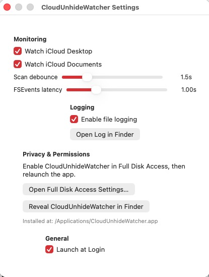
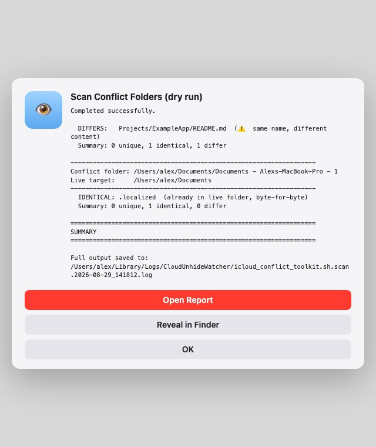
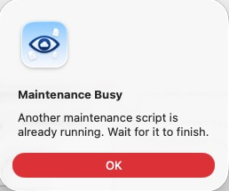
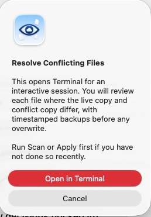
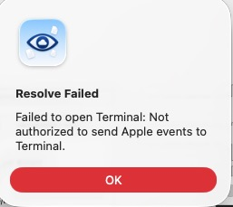

# Toolkit Reports, Dialogs, and Sample Output

This page shows what you see after menu actions: confirmation dialogs, result sheets, error alerts, and the log files written under `~/Library/Logs/CloudUnhideWatcher/`.

All paths and host names below are **fictional** (`alex`, `Alexs-MacBook-Pro`) so you can preview output without exposing a real Mac or iCloud account.

## Settings window

Open via menu bar → **Settings…** (⌘,).



| Control | What it does |
|---------|----------------|
| **Watch iCloud Desktop** | When checked, the app watches `~/Desktop` for iCloud re-hide events and restores visibility. |
| **Watch iCloud Documents** | Same for `~/Documents`. |
| **Scan debounce** (slider) | Minimum seconds between full scans after FSEvents activity (0.5–5.0 s). Higher = fewer scans, lower CPU. |
| **FSEvents latency** (slider) | Coalescing window for file-system events (0.25–3.0 s). |
| **Enable file logging** | Writes detailed lines to `~/Library/Logs/icloud-unhide-watcher.log`. |
| **Open Log in Finder** | Opens **Finder** with the log file selected in `~/Library/Logs/`. |
| **Open Full Disk Access Settings…** | Opens **System Settings → Privacy & Security → Full Disk Access**. |
| **Reveal CloudUnhideWatcher in Finder** | Opens **Finder** with `/Applications/CloudUnhideWatcher.app` selected (use the **+** button in FDA to add the app). |
| **Installed at:** (caption) | Read-only path of the running app bundle. |
| **Launch at Login** | Registers or removes the app in **System Settings → General → Login Items**. |

When **Local hidden files** assist is enabled (newer builds), the same window also lists non-iCloud folders, **Add Folder…**, and **Continuously monitor selected local folders**. See [Operator Guide](operator-guide.md).

---

## Result sheet (after Diagnose, Scan, Apply, Verify, Report)

When a toolkit run finishes, a summary alert appears. Example from **Scan Conflict Folders (dry run)** (fictional user `alex` — not a real Mac):



| Button | Opens |
|--------|--------|
| **Open Report** | Default text editor (usually **TextEdit**) with the full timestamped log file, e.g. `icloud_conflict_toolkit.sh.scan.2026-08-29_141812.log`. |
| **Reveal in Finder** | **Finder** window with the log file highlighted in `~/Library/Logs/CloudUnhideWatcher/`. |
| **OK** | Closes the sheet; no file is opened. |

The body shows exit status, a short **SUMMARY** excerpt from the script, and the full log path.

Log naming pattern:

```text
~/Library/Logs/CloudUnhideWatcher/icloud_conflict_toolkit.sh.<command>.<YYYY-MM-DD_HHMMSS>.log
```

---

## Maintenance Busy

Shown if you start a second toolkit action while one is still running.



| Button | Opens |
|--------|--------|
| **OK** | Closes the alert. Wait for the in-progress job to finish, then try again. |

Only one bundled script runs at a time from the menu bar.

---

## Apply Conflict Merge — confirmation (before run)

**Apply Conflict Merge…** shows a warning **before** the script runs (not pictured). Buttons:

| Button | Action |
|--------|--------|
| **Continue** | Starts apply; unique files may be moved into live Desktop/Documents. |
| **Cancel** | Aborts; nothing runs. |

---

## Resolve Conflicting Files — confirmation

For files marked **DIFFERS** (same name, different bytes), use **Resolve Conflicting Files…**:



| Button | Opens |
|--------|--------|
| **Open in Terminal** | **Terminal.app** with an interactive `icloud_conflict_toolkit.sh resolve` session. You choose live vs conflict copy per file; live copies are backed up first. |
| **Cancel** | Closes without opening Terminal. |

Run **Scan** or **Apply** first so you know which files differ.

---

## Resolve Failed — Terminal automation

If macOS has not granted **Automation** permission for CloudUnhideWatcher to control Terminal:



| Button | Opens |
|--------|--------|
| **OK** | Closes the alert. |

**Fix:** **System Settings → Privacy & Security → Automation** → enable **Terminal** under CloudUnhideWatcher. Alternatively run resolve manually:

```bash
/Applications/CloudUnhideWatcher.app/Contents/Resources/icloud_conflict_toolkit.sh resolve
```

---

## Sample toolkit reports (fictional)

These match the structure of real logs. Full copies ship in [sample-reports/](sample-reports/).

### Diagnose (`diagnose`)

Health check only — no file moves.

```text
==================================================================
DIAGNOSE — local iCloud hidden-file / sync health check on: Alexs-MacBook-Pro
==================================================================

--- CloudUnhideWatcher install ---
  ✅ PASS: App found at /Applications/CloudUnhideWatcher.app
  ✅ PASS: CloudUnhideWatcher process is running

--- Full Disk Access / CloudDocs container ---
  ✅ PASS: CloudDocs container is readable

--- Watch roots hidden check ---
  ✅ PASS: Watch root not hidden: /Users/alex/Desktop
  ✅ PASS: Watch root not hidden: /Users/alex/Documents

--- iCloud conflict folders on this Mac ---
     - /Users/alex/Desktop/Desktop - Alexs-MacBook-Pro
     - /Users/alex/Documents/Documents - Alexs-MacBook-Studio
     - /Users/alex/Documents/Documents - Alexs-MacBook-Pro - 1
  ❌ FAILED: 3 conflict folder(s) present

==================================================================
DIAGNOSE RESULT: 1 issue(s) found on Alexs-MacBook-Pro — see notes above
==================================================================
```

[Full sample: diagnose-sample.txt](sample-reports/diagnose-sample.txt)

### Scan (`scan`) — dry run

Classifies each file in conflict folders as **UNIQUE**, **IDENTICAL**, or **DIFFERS**.

```text
==================================================================
MODE: SCAN (dry run) — no files will be moved
==================================================================

------------------------------------------------------------------
Conflict folder: /Users/alex/Documents/Documents - Alexs-MacBook-Pro - 1
Live target:     /Users/alex/Documents
------------------------------------------------------------------
  IDENTICAL: .localized  (already in live folder, byte-for-byte)
  DIFFERS:   Projects/ExampleApp/README.md  (⚠️  same name, different content)
  Summary: 0 unique, 1 identical, 1 differ

Totals: 1 unique, 4 identical, 1 differ

⚠️  1 file(s) need manual review — run:
     icloud_conflict_toolkit.sh resolve
```

[Full sample: scan-sample.txt](sample-reports/scan-sample.txt)

### Apply (`apply`)

Moves **UNIQUE** files only; saves a per-folder snapshot for verify.

```text
==================================================================
MODE: APPLY — unique files WILL be moved into the live folder
==================================================================

  MOVED:     Budget-2026.xlsx → /Users/alex/Desktop/Budget-2026.xlsx
  Moved: 1, Failed: 0
  📌 Snapshot saved for future 'verify': a1b2c3d4.snapshot

Totals: 1 unique, 4 identical, 1 differ
        1 moved successfully, 0 failed
```

[Full sample: apply-sample.txt](sample-reports/apply-sample.txt)

### Verify (`verify`)

Compares conflict folders to the last apply snapshot.

```text
==================================================================
MODE: VERIFY — compare conflict folders to last apply snapshot
==================================================================

  ⚠️  REGROWN: 2 new file(s) appeared in conflict folder since snapshot
     → Another Mac may still be writing to this conflict copy

==================================================================
VERIFY RESULT: 1 folder(s) show regrowth — repeat merge on each Mac on the account
==================================================================
```

[Full sample: verify-sample.txt](sample-reports/verify-sample.txt)

### Full Report (`report`)

Runs **diagnose** and **scan** in one log file. The result sheet is the same as other commands; the log contains both sections back-to-back.

---

## Report file categories

| Source | Log prefix | Created when |
|--------|------------|--------------|
| iCloud conflict toolkit | `icloud_conflict_toolkit.sh.*.log` | Menu **iCloud Tools** actions |
| Local hidden toolkit | `local_hidden_toolkit.sh.*.log` | Menu **Local Tools** actions (when enabled) |
| App runtime | `icloud-unhide-watcher.log` | **Enable file logging** in Settings |

Snapshots from apply live in `~/.icloud_conflict_toolkit_state/` (not in Logs).

---

## Related

- [Menu Bar Navigation](navigation.md) — every menu item and shortcut
- [iCloud Tools](icloud-tools.md) — command reference and safety rules
- [Troubleshooting](troubleshooting.md) — FDA, Automation, conflict workflows
