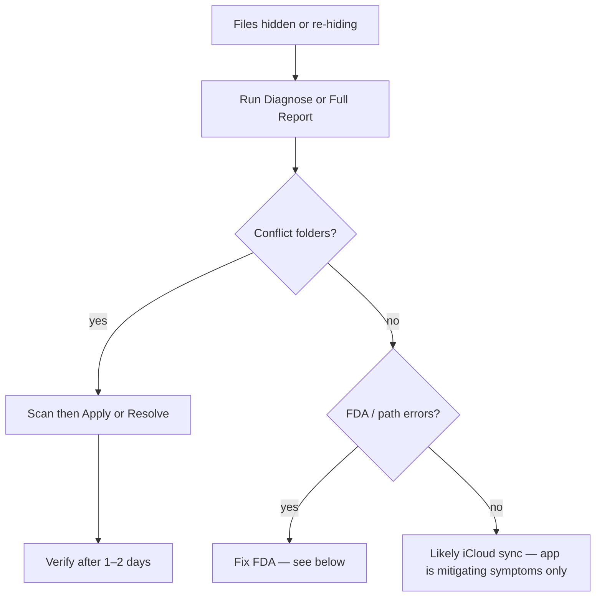

# Troubleshooting

## Decision flow



See [Process Flows](process-flows.md) for full diagrams.

## Files keep re-hiding

CloudUnhideWatcher clears local hidden flags; it does **not** fix upstream iCloud sync conflicts. If files re-hide within seconds, iCloud or another process is re-applying `UF_HIDDEN`.

Work through these steps in order:

### 1. Run diagnose (read-only)

**Menu:** iCloud Tools → **Diagnose iCloud Health…** or **Full Report…**

Or from Terminal:

```bash
TOOLKIT="/Applications/CloudUnhideWatcher.app/Contents/Resources/Scripts/icloud_conflict_toolkit.sh"
bash "${TOOLKIT}" diagnose
bash "${TOOLKIT}" report    # diagnose + scan
```

The report checks install path, FDA/CloudDocs access, hidden watch roots, hidden files, conflict folders, and log contention. Output is saved under `~/Library/Logs/CloudUnhideWatcher/`. See [fictional sample output](toolkit-reports-and-dialogs.md#sample-toolkit-reports-fictional).

### 2. Check for conflict folders

Look for folders named like:

- `Desktop - <hostname>`
- `Documents - <hostname>`

These indicate multi-Mac iCloud Desktop & Documents conflicts. Use [iCloud Tools](icloud-tools.md) to preview and merge.

### 3. Merge conflict folders

| Mode | Action |
|------|--------|
| **Scan** | Lists UNIQUE / IDENTICAL / DIFFERS; moves nothing |
| **Apply** | Moves UNIQUE files only; never overwrites live files |
| **Verify** | Compares conflict folders to saved snapshot; detects regrowth |
| **Resolve** | Interactive Terminal session for DIFFERS files — see [Toolkit Reports & Dialogs](toolkit-reports-and-dialogs.md#resolve-conflicting-files--confirmation) if Terminal automation fails |

The toolkit **never deletes** conflict folders automatically. **Apply** never overwrites existing live files. Run **Verify** again after a day or two; **REGROWN** means another Mac is still writing into the conflict copy — repeat on **each Mac** on the same iCloud account.

### 4. When to stop chasing app bugs

If diagnose shows low contention but Finder still flickers, or scan reports many **DIFFERS** rows, treat it as an iCloud sync problem (multi-Mac conflicts, dataless placeholders, materialization failures) — not a CloudUnhideWatcher defect.

## Full Disk Access issues

| Symptom | Fix |
|---------|-----|
| Menu shows "Needs Full Disk Access" | Enable FDA for `/Applications/CloudUnhideWatcher.app` |
| App not listed in FDA | Click **+**, select the installed app; do not run `swift run` |
| FDA enabled but still denied | Reset TCC: `tccutil reset SystemPolicyAllFiles com.ruter.cloudunhidewatcher`, re-grant, relaunch |
| ENOTDIR / path errors | Use signed build from `/Applications/`; ensure iCloud Desktop & Documents is enabled |

## Hidden Desktop or Documents root

If the entire Desktop or Documents folder is hidden in Finder, the app clears hidden state on watch roots as well as children. Run **Scan Now** after granting FDA.

## High CPU during heavy activity

The app rescans the full tree on coalesced FSEvents. Very large folders with frequent unrelated activity may use more CPU. Pause monitoring during bulk downloads to Desktop if needed.

## Logs

- File log: `~/Library/Logs/icloud-unhide-watcher.log`
- iCloud Tools reports: `~/Library/Logs/CloudUnhideWatcher/`
- Console: filter `com.ruter.cloudunhidewatcher`

## Related

- [Process Flows](process-flows.md)
- [iCloud Tools](icloud-tools.md)
- [Getting Started](getting-started.md)
- [Operator Guide](operator-guide.md)
